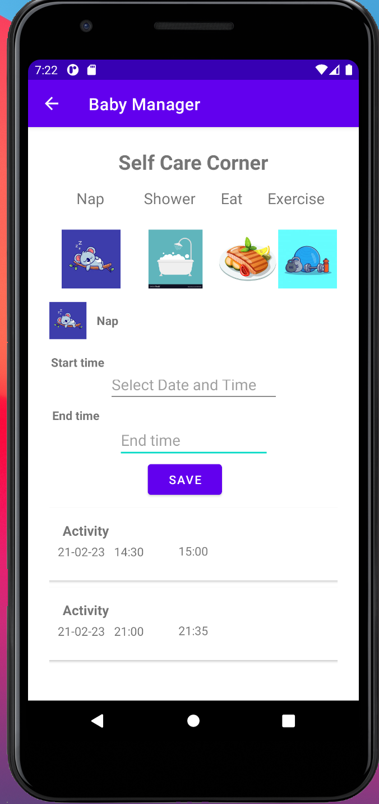

# BabyManager

> BabyManager is an Android app. Baby Manager will help you keep track of all things baby! 

> User can keep track of baby's feeding, diaper change, sleep and user's self care.

> Tech Stack: Java and Android SDK

## Table of Contents
- [Java and Android SDK ](#java-and-android-sdk)
- [App Features](#app-features)
- [FAQ](#faq)
- [Trello Link](#trello-link)

## Java and Android SDK 

- [Room Database](#room-database)

## Room Database
> Room database was used to save the activities from each option of the app. Main components of room: Entity, Dao and Database. 

Dependencies added for Room to build.gradle
```shell
def room_version = "2.2.6"

  implementation "androidx.room:room-runtime:$room_version"
  annotationProcessor "androidx.room:room-compiler:$room_version"

  // optional - RxJava support for Room
  implementation "androidx.room:room-rxjava2:$room_version"

  // optional - Guava support for Room, including Optional and ListenableFuture
  implementation "androidx.room:room-guava:$room_version"

  // optional - Test helpers
  testImplementation "androidx.room:room-testing:$room_version"
```
---

## App Features

### Overview

App View | Actions|
--- | :--- | 
 | <ul><li>Home Page</li><li>Click any of the four options to start tracking your baby's activities</li></ul>|
| <ul><li>4 Feeding Options</li><li>Click on Left or Right side, you have the option to set a date and time. Start a chronometer</li><li>Click on the Bottle option, you have the option to set a date and time. Enter amount in ounces and select between breast milk or formula</li><li>Click on the Supplement option where you may enter and save the description</li><li>User can enter the info needed and save the activity</li></ul>|
 | <ul><li>Diaper Change Option</li><li>User can set a date and time</li><li>User select options of the diaper status</li><li>User can enter the info needed and save the activity</li></ul>|
 | <ul><li>Sleep Option</li><li>User can set a date and time when the baby fell asleep</li><li>User can set a date and time when the baby woke up</li><li>User can enter the info needed and save the activity</li></ul>|
 | <ul><li>4 Self Care Options</li><li>Click on Nap, you have the option to set a date and time</li><li>Click on Shower, you have the option to set a date and time</li><li>Click on Eat, you have the option to set a date and time</li><li>Click on Exercise, you have the option to set a date and time</li><li>User can enter the info needed and save the activity</li></ul>|

---

## FAQ

- **Why did I create BabyManager?**
    - BabyManager is a Capstone project I worked on during Ada Developers Academy Cohort 14 (3 weeks project January 2021)

- **Who can use your app?**
    - Any mom, dad or relative taking care of a baby. They can save and organize all the activities that are part of taking care a baby in one place.

- **What is the hardest part of this project?**
    - Handling the views on the activities and fragments on Android Studio. Something that took some time as well was setting up the database.

- **What did I learn?**
    - Creating small projects using the new Tech Stack before starting the project, gave me the opportunity to break and fix things before starting my main project.
    - Using a Trello board (collaboration tool) and splitting the entire project  into waves, helped me being realistic of what to prioritize or not to be able to provide a viable MVP and not be stressed too much in the process.


---

## Trello Link
- [BabyManager trello link](https://trello.com/b/BQVyHWZC/gessicas-capstone)
